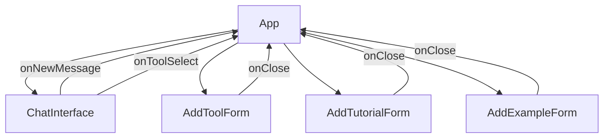

# מבנה הקומפוננטות

## App.tsx
הקומפוננטה הראשית של האפליקציה. מכילה:
- ניהול מצב הצ'אט והודעות
- ניהול העדפות המשתמש
- טעינת כלים מסופאבייס
- הצגת טפסים להוספת תוכן

### State
- `messages`: מערך ההודעות בצ'אט
- `userPreferences`: העדפות המשתמש (מטרה, סוג תוכן)
- `tools`: מערך הכלים מהמסד נתונים
- `showAddForm`: איזה טופס להציג
- `selectedToolId`: הכלי הנבחר הנוכחי

### פונקציות
- `handleNewMessage`: מטפל בהודעות חדשות מהמשתמש
- `processUserInput`: מעבד את קלט המשתמש ומייצר תגובה
- `handleToolSelect`: מטפל בבחירת כלי

## ChatInterface.tsx
ממשק הצ'אט. מציג את ההודעות ומאפשר למשתמש להזין הודעות חדשות.

### Props
- `messages`: מערך ההודעות להצגה
- `onNewMessage`: פונקציה לטיפול בהודעות חדשות
- `onToolSelect`: פונקציה לטיפול בבחירת כלי

### תכונות
- תצוגת הודעות עם סגנון שונה למשתמש ולמערכת
- גלילה אוטומטית לתחתית
- הצגה מיוחדת של רשימת כלים עם אפשרות לחיצה

## AddToolForm.tsx
טופס להוספת כלי חדש למאגר.

### Props
- `onClose`: פונקציה לסגירת הטופס

### שדות
- שם הכלי
- תיאור
- כתובת URL
- רמת תמיכה בעברית (1-5)
- רמת חינמיות (1-5)
- רמת חוויתיות (1-5)
- ערך פדגוגי (1-5)
- סוגי תוצרים (מרובה)
- הקשרים פדגוגיים (מרובה)
- פורמט תקשורת
- רמת מורכבות (1-5)

## AddTutorialForm.tsx
טופס להוספת הדרכה לכלי.

### Props
- `toolId`: מזהה הכלי
- `onClose`: פונקציה לסגירת הטופס

### שדות
- כותרת
- פורמט
- כתובת URL
- מידע נוסף
- יוצר
- תורם
- דירוג (1-5)

## AddExampleForm.tsx
טופס להוספת דוגמת שימוש.

### Props
- `toolId`: מזהה הכלי
- `onClose`: פונקציה לסגירת הטופס

### שדות
- כותרת
- כתובת URL
- תיאור/פרומפט
- יוצר
- תורם
- דירוג (1-5)

## זרימת המידע

## ניהול מצב

- מצב גלובלי מנוהל ב-App.tsx
- כל קומפוננטה מנהלת את המצב הפנימי שלה (טפסים, קלט)
- סופאבייס משמש כמקור האמת עבור הנתונים

## סגנונות

- שימוש ב-Tailwind CSS
- הגדרות מותאמות אישית ב-`src/styles/index.css`
- שימוש בקומפוננטות מ-HeadlessUI לנגישות
- אייקונים מ-HeroIcons 